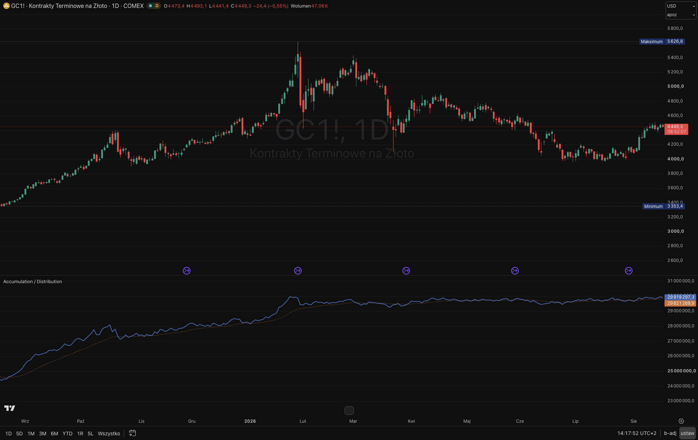

# tradingview-pine-scripts

📊 Indicators and strategies in Pine Script® for TradingView.

> 📝 Technical notes and Pine Script cheatsheet: [NOTES.md](NOTES.md)

## Table of contents

- [Indicators](#indicators)
  - [Overlays](#overlays)
    - [1x MA](#1x-ma)
    - [2x MA](#2x-ma)
    - [3x MA](#3x-ma)
    - [Envelopes](#envelopes)
    - [Bollinger Bands](#bollinger-bands)
    - [GMMA](#gmma)
    - [Golden / Death Cross](#golden--death-cross)
    - [Vertical Hour Lines](#vertical-hour-lines)
    - [Session Open Line](#session-open-line)
  - [Seasonality](#seasonality)
    - [Monthly Seasonality](#monthly-seasonality)
    - [Daily Seasonality](#daily-seasonality)
    - [Hourly Seasonality](#hourly-seasonality)
  - [Histograms](#histograms)
    - [MA Spread Histogram](#ma-spread-histogram)
  - [Oscillators](#oscillators)
    - [MACD](#macd)
    - [Stochastic Oscillator](#stochastic-oscillator)
    - [RSI](#rsi)
    - [ROC](#roc)
  - [Volume](#volume)
    - [Accumulation / Distribution](#accumulation--distribution)
    - [Accumulation / Distribution Density](#accumulation--distribution-density)
    - [Delta Footprint Bubble](#delta-footprint-bubble)
    - [Delta Footprint Histogram](#delta-footprint-histogram)
    - [Delta Footprint Table](#delta-footprint-table)
    - [Delta Footprint Imbalance](#delta-footprint-imbalance)

## Indicators

### Overlays

#### [1x MA](indicators/overlays/1x-ma.pine)

A single moving average — SMA / EMA / WMA / VWMA / RMA. Optional label with the length and type (e.g. "200 EMA") at the end of the line.

#### [2x MA](indicators/overlays/2x-ma.pine)

Two moving averages, each with a configurable type. Optional labels with the length and type at the line ends.

#### [3x MA](indicators/overlays/3x-ma.pine)

Three moving averages. Optional labels with the length and type at the line ends.

#### [Envelopes](indicators/overlays/envelopes.pine)

Envelopes around a moving average — upper and lower percentage deviation.

#### [Bollinger Bands](indicators/overlays/bollinger-bands.pine)

Bollinger Bands — SMA ± standard deviation.

#### [GMMA](indicators/overlays/gmma.pine)

Guppy Multiple Moving Average — two EMA groups: short-term (speculators) and long-term (investors).

#### [Golden / Death Cross](indicators/overlays/golden-death-cross.pine)

Golden Cross and Death Cross — crossings of a fast and a slow average (classically SMA 50 vs SMA 200).

#### [Vertical Hour Lines](indicators/overlays/vertical-hour-lines.pine)

Vertical lines at the given hours — 10 independent slots, each with its own toggle, hour, color, style, and width (one settings row per slot). Enabled by default: 10:30, 15:00, 20:00, and 23:00 as a light-purple dashed line with 70% transparency. Selectable time zone (Warsaw by default; optionally exchanges, UTC, or a custom IANA zone) — it must match the chart's time-axis zone, otherwise the lines land shifted.

#### [Session Open Line](indicators/overlays/session-open-line.pine)

A horizontal line at the session open price, drawn from the first to the last bar of the session. Completed sessions keep a single label above the end of the line with the percent price change during the session (close vs open). Optionally the ongoing session shows the percent live - at the open price level, to the right of the line end, as if continuing the line - and the label moves to the standard place above the line once the session completes. The line and label colors depend on the sign of the change. Works on intraday timeframes — on D and above every bar is its own session, so the indicator only shows a hint.

### Seasonality

#### [Monthly Seasonality](indicators/seasonality/monthly-seasonality.pine)

Chart background colored by month — seasonal patterns become visible (e.g. Lean Hogs). Each of the 12 months can be toggled; the names include futures contract codes (F, G, H, …).

#### [Daily Seasonality](indicators/seasonality/daily-seasonality.pine)

Chart background colored by day of the week — a rainbow across the week (Monday → Sunday), with the option to disable selected days.

#### [Hourly Seasonality](indicators/seasonality/hourly-seasonality.pine)

Chart background colored by hour — a daily gradient (night → dawn → day → dusk). Active hours selected with a text field, e.g. `"9-16,18,22"`.

### Histograms

#### [MA Spread Histogram](indicators/histograms/ma-spread-histogram.pine)

A histogram showing the distance between price and a moving average.

### Oscillators

#### [MACD](indicators/oscillators/macd.pine)

Moving Average Convergence Divergence — the difference of two averages with a signal line.

#### [Stochastic Oscillator](indicators/oscillators/stochastic-oscillator.pine)

Stochastic Oscillator — %K and %D lines with overbought/oversold levels.

#### [RSI](indicators/oscillators/rsi.pine)

Relative Strength Index with the 30 / 70 levels.

#### [ROC](indicators/roc.pine)

Rate of Change — the percentage price change over a given period.

### Volume

#### [Accumulation / Distribution](indicators/volume/accumulation-distribution.pine)

The A/D line by Marc Chaikin — combines price with volume, measuring buying and selling pressure.

#### [Accumulation / Distribution Density](indicators/volume/accumulation-distribution-density.pine)

Accumulation / distribution density (VD) — modeled after Mieczyslaw Siudek's indicator from xStation (XTB). Looks for candles whose volume-to-price-movement ratio (**density** = volume per unit of range) is disproportionately high and which set a local extreme — heavy turnover with little movement at a low/high suggests position accumulation/distribution and a potential turning point. **▲ marker** below a candle = accumulation density (potential bullish signal), **▼ marker** above a candle = distribution density (potential bearish signal); the marker shape (triangle, arrow, label arrow, circle, diamond), size, and colors are configurable. Parameters as in xStation: Max/Min of, Average Spread of, Average Density of, Spread Factor (with a toggle), Density Factor, and the Bar close % filter. Built-in `alertcondition` for both signals. Requires an instrument with volume data (TVC CFDs lack it — use e.g. futures contracts).

#### [Delta Footprint Bubble](indicators/volume/delta-footprint-bubble.pine)

Volume delta from real footprint data (`request.footprint()`, available since January 2026) — the difference between aggressive buy volume (at the ask) and sell volume (at the bid) within a candle. The value shown as a **number next to each candle** (green = buy dominance, red = sell; above/below the candle or above/below the POC bubble, with a configurable gap). Each candle's POC as an **optional Bookmap-style bubble** (size ∝ volume, the same power normalization as in the histogram), with an optional **POC trail** (a line connecting the bubbles — a segmented polyline or a smooth, rounded curve). Additionally **Value Area (VAH/VAL)**. When the candle direction contradicts the delta (rising with negative delta or falling with positive) — the delta number is shown **in bold**.

> ⚠️ Requires a TradingView **Premium** or **Ultimate** account — without it the script does not compile. `request.footprint()` works only for the chart's **current timeframe**.

#### [Delta Footprint Histogram](indicators/volume/delta-footprint-histogram.pine)

The footprint delta as a **histogram in a separate panel** (behaves like the built-in Volume indicator): a column = the candle's |delta|, green with buy dominance, red with sell. The real delta as a **number on the column** and in the data window; with the cursor, the legend shows the true value (not the normalized height). The height is **power-normalized** (adjustable strength) and capped at a given % of the panel.

> ⚠️ Requires **Premium / Ultimate**; `request.footprint()` only for the current timeframe.

#### [Delta Footprint Table](indicators/volume/delta-footprint-table.pine)

A standalone footprint **status table** (buy / sell / delta + % / **stacked imbalance** / POC / Value Area / CVD) in a chart corner — extracted from "Bubble", it computes its own metrics, so it works independently. Add it next to "Delta Footprint Bubble" or "Delta Footprint Histogram". The **Imbalance** row summarizes the current candle's stacked diagonal imbalances (▲ buy levels, ▼ sell levels). The header bar shows the **current timeframe** ("Last candle · 1m") and reminds you that buy/sell/delta/POC apply **only to the last candle** (CVD accumulates over the session).

> ⚠️ Requires **Premium / Ultimate**; `request.footprint()` only for the current timeframe.

#### [Delta Footprint Imbalance](indicators/volume/delta-footprint-imbalance.pine)

Detects **footprint imbalances** (diagonal: one side ≥ _ratio_ × the diagonally opposite one, classically 3:1) and their **stacked** runs (N+ levels in the same direction). Every stacked imbalance becomes a **persistent support/resistance zone** (a box extending to the right) with **automatic mitigation** — once tested by price, the zone fades or disappears, so only live levels remain on the chart (order-block behavior). Run strength is mapped to **color intensity**. A mini-dashboard counts active bull/bear zones and points to the nearest one above/below price. Full description: [delta-footprint-imbalance.md](indicators/volume/delta-footprint-imbalance.md).

> ⚠️ Requires **Premium / Ultimate**; `request.footprint()` only for the current timeframe. Makes sense on low timeframes (1–15 m).

## License

[The MIT License](https://piecioshka.mit-license.org) @ 2026
