# tradingview-pine-scripts

📊 Indicators in Pine Script® for TradingView.

> 📝 Technical notes and Pine Script cheatsheet: [NOTES.md](NOTES.md)
>
> 📖 Indicators with in-depth documentation (formulas, diagrams, parameters, how to read them) are marked below with a "Full documentation" link - the note lives next to its `.pine` file.

## Table of contents

- [Indicators](#indicators)
  - [Overlays](#overlays)
    - [1x MA](#1x-ma)
    - [2x MA](#2x-ma)
    - [3x MA](#3x-ma)
    - [Envelopes](#envelopes)
    - [Bollinger Bands](#bollinger-bands)
    - [GMMA](#gmma)
    - [Golden / Death Cross](#golden--death-cross)
    - [Vertical Hour Lines](#vertical-hour-lines)
    - [Session Open Line](#session-open-line)
    - [Last Time at Price](#last-time-at-price)
    - [Overbalance](#overbalance)
  - [Seasonality](#seasonality)
    - [Monthly Seasonality](#monthly-seasonality)
    - [Daily Seasonality](#daily-seasonality)
    - [Hourly Seasonality](#hourly-seasonality)
  - [Oscillators](#oscillators)
    - [MACD](#macd)
    - [MA Spread Histogram](#ma-spread-histogram)
    - [Stochastic Oscillator](#stochastic-oscillator)
    - [RSI](#rsi)
    - [ROC](#roc)
  - [Volume](#volume)
    - [Accumulation / Distribution Density](#accumulation--distribution-density)
    - [Delta Footprint Bubble](#delta-footprint-bubble)
    - [Delta Footprint Histogram](#delta-footprint-histogram)
    - [Delta Footprint Table](#delta-footprint-table)

## Indicators

### Overlays

#### [1x MA](indicators/overlays/1x-ma.pine)

A single moving average - SMA / EMA / WMA / VWMA / RMA (default 50 EMA). Optional label with the length and type (e.g. "200 EMA") at the end of the line.

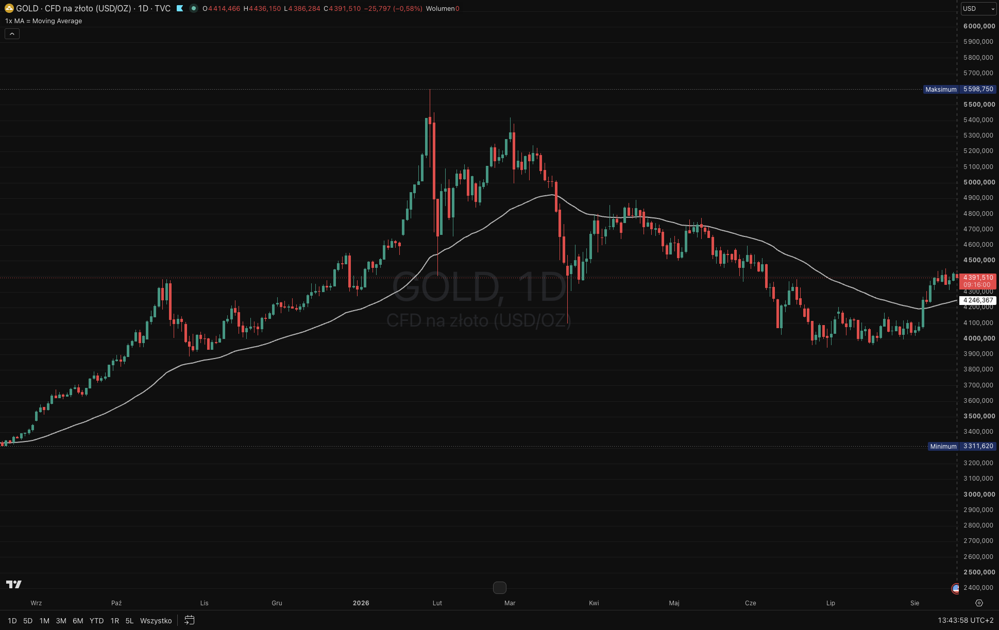

#### [2x MA](indicators/overlays/2x-ma.pine)

Two moving averages, each with a configurable type (default SMA 50 and 200). Optional labels with the length and type at the line ends, plus signal markers at the crosses (golden / death cross) - marker shape (triangle, arrow, label arrow, circle, diamond) and size are configurable.

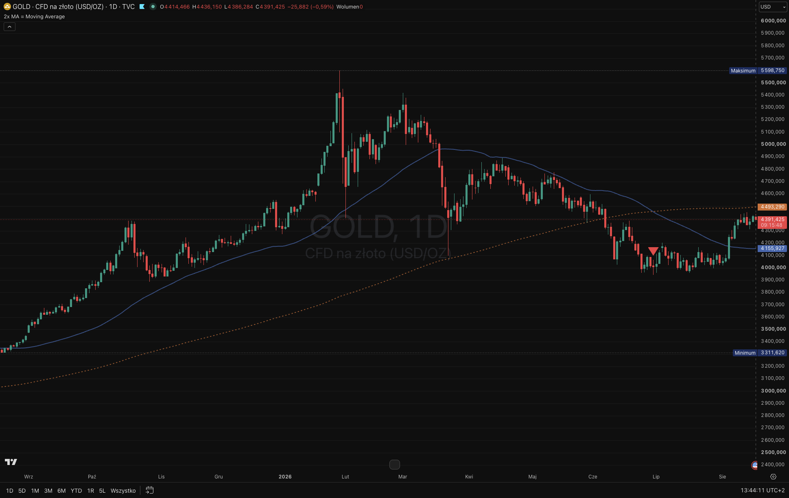

#### [3x MA](indicators/overlays/3x-ma.pine)

Three moving averages (default SMA 4, 9, and 18). Optional labels with the length and type at the line ends.

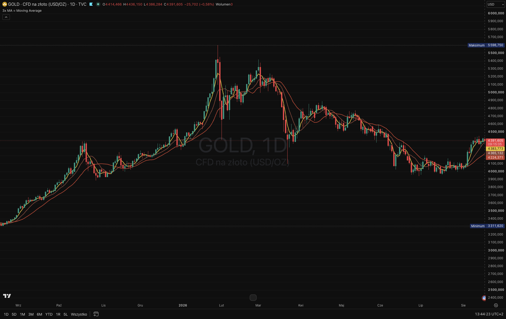

#### [Envelopes](indicators/overlays/envelopes.pine)

Envelopes around a moving average - upper and lower percentage deviation (default 3% around SMA 21).

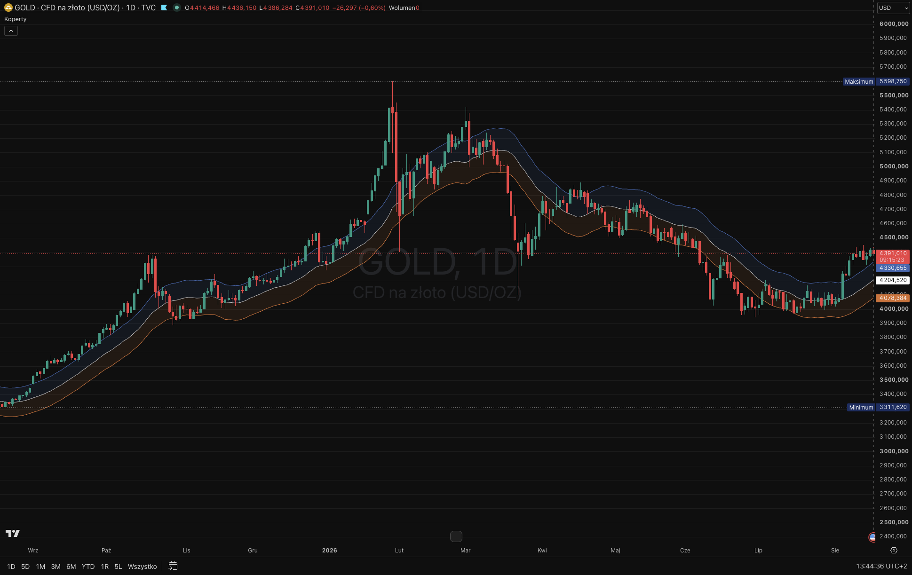

#### [Bollinger Bands](indicators/overlays/bollinger-bands.pine)

Bollinger Bands - SMA (default 20) ± a configurable number of standard deviations (default 2). Optional mean-reversion signal markers (configurable shape and size) when close crosses the lower / upper band.

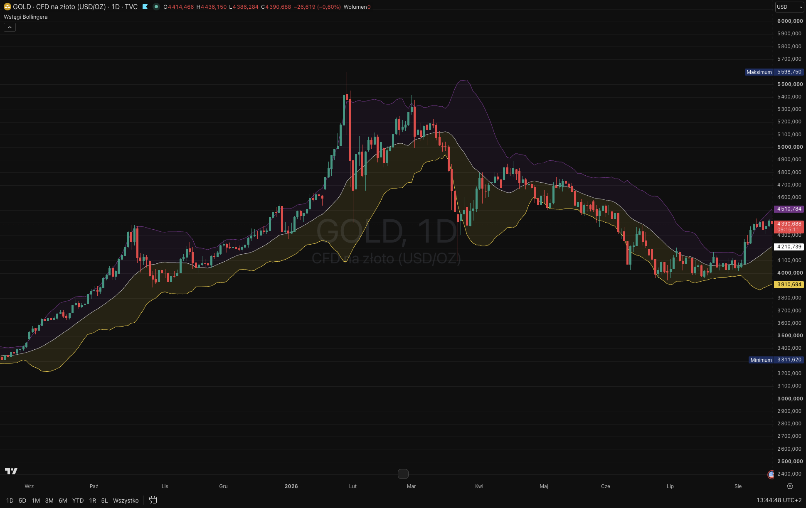

#### [GMMA](indicators/overlays/gmma.pine)

Guppy Multiple Moving Average - two EMA groups: short-term (speculators) and long-term (investors).

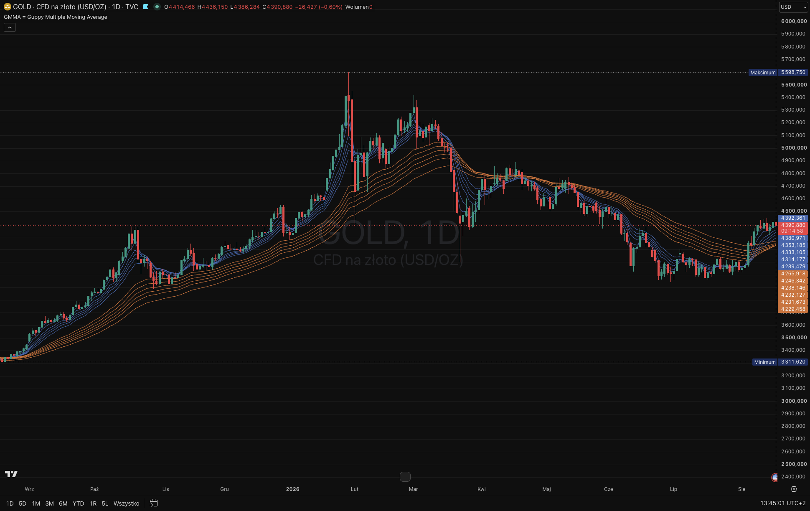

#### [Golden / Death Cross](indicators/overlays/golden-death-cross.pine)

Golden Cross and Death Cross - crossings of a fast and a slow average (classically SMA 50 vs SMA 200). Each cross gets a vertical dashed line, a GOLDEN CROSS / DEATH CROSS label, and a marker with a configurable shape and size.

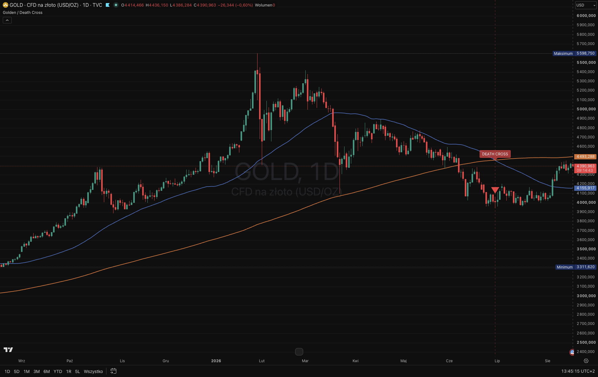

#### [Vertical Hour Lines](indicators/overlays/vertical-hour-lines.pine)

Vertical lines at the given hours - 10 independent slots, each with its own toggle, hour, color, style, and width (one settings row per slot). Enabled by default: 10:30, 15:00, 20:00, and 23:00 as a light-purple dashed line with 70% transparency. Selectable time zone (Warsaw by default; optionally exchanges, UTC, or a custom IANA zone) - it must match the chart's time-axis zone, otherwise the lines land shifted.

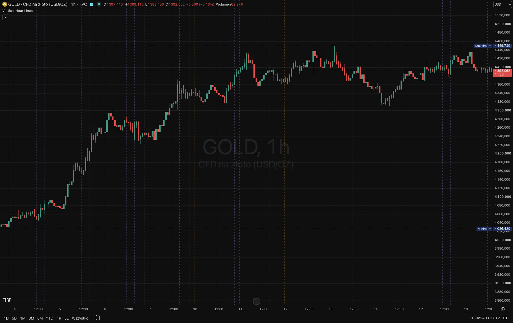

#### [Session Open Line](indicators/overlays/session-open-line.pine)

A horizontal line at the session open price, drawn from the first to the last bar of the session. A label carries the percent price change during the session (close vs open). The "Percent position" dropdown picks where that label sits - "Behind the line" (default) at the open price level, right of the line end, as if continuing it, or "Above the line" over the end of the session open line - and the choice applies the same way to completed sessions and to the ongoing one. Optionally the ongoing session updates the percent live. The line and label colors depend on the sign of the change. Works on intraday timeframes - on D and above every bar is its own session, so the indicator only shows a hint.

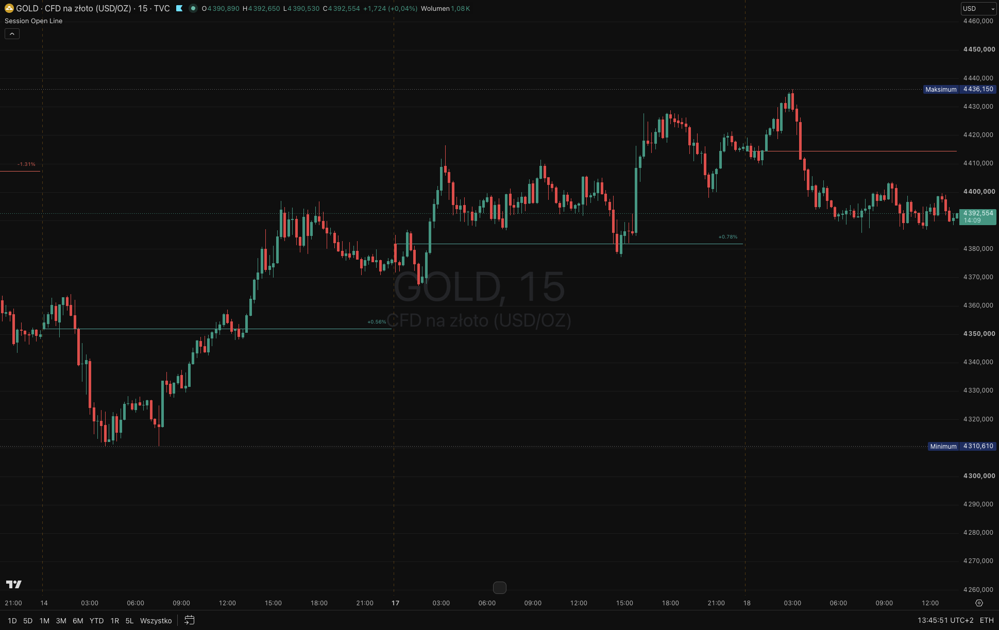

#### [Last Time at Price](indicators/overlays/last-time-at-price.pine)

A label next to the current price line showing when the market was last at this level - the nearest bar back (up to 5000) whose low-high range covered the current price. Configurable label template (`{date}`, `{bars}` placeholders), date format, time zone (exchange or UTC), text size, colors, and an "ignore last X bars" filter; when no bar in the lookback matches, a gray "No such price" label appears instead.

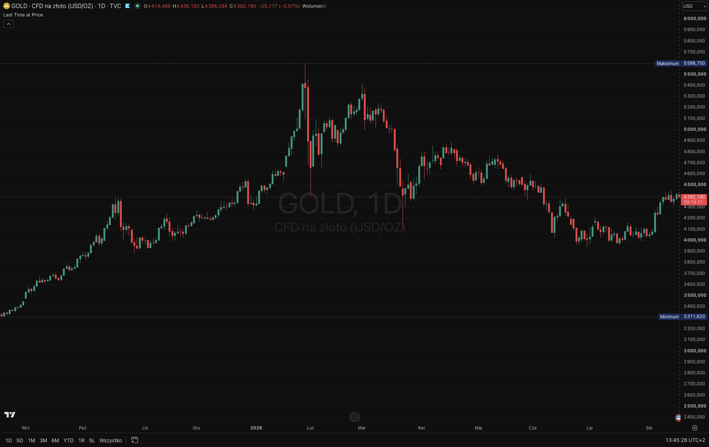

#### [Overbalance](indicators/overlays/overbalance.pine)

Overbalance - market geometry described by Bryce Gilmore and popularized in Poland by Łukasz Stefanik. One sentence carries the method: the trend lasts as long as the largest correction of that trend is not permanently broken. A correction of that trend becomes the "magic rectangle" - measured between two confirmed swings (`ta.pivothigh` / `ta.pivotlow`), then extended to the right as the live zone the method trades: entry at its far edge, target at the trend extreme, stop one tolerance beyond it. Which correction is the reference is a "Reference correction" input - the sources are not formalized on this point, so the default is the first correction of the trend, the one they name as conducting it, while "largest so far" (the literal wording) and "last correction" stay available. The tolerance is what "permanently" means - the method names 13%, 20% and 33% of the overbalance range, trading win rate against reward to risk (33% by default), and a break can be required to close beyond the level rather than merely wick through it. Corrections are only ever compared to corrections, and anything below the noise filter is skipped - the method treats moves under 40 points on DAX as noise, with percent and ATR units available for other instruments. Broken rectangles stay on the chart in gray, and a break fires a marker, a label and an alert condition. A diagnostics panel reports the live state of the measurement - trend, active filter, swings seen, legs rejected with the largest one among them, the overbalance size, and the entry / stop / target levels - plus a one-line verdict, so an empty chart says why it is empty instead of looking broken.

### Seasonality

#### [Monthly Seasonality](indicators/seasonality/monthly-seasonality.pine)

Chart background colored by month - seasonal patterns become visible (e.g. Lean Hogs). Each of the 12 months can be toggled; the names include futures contract codes (F, G, H, …).

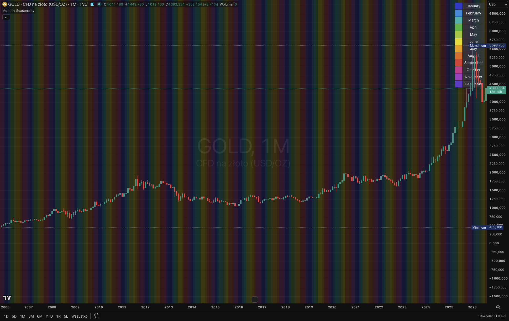

#### [Daily Seasonality](indicators/seasonality/daily-seasonality.pine)

Chart background colored by day of the week - a rainbow across the week (Monday → Sunday), with the option to disable selected days.

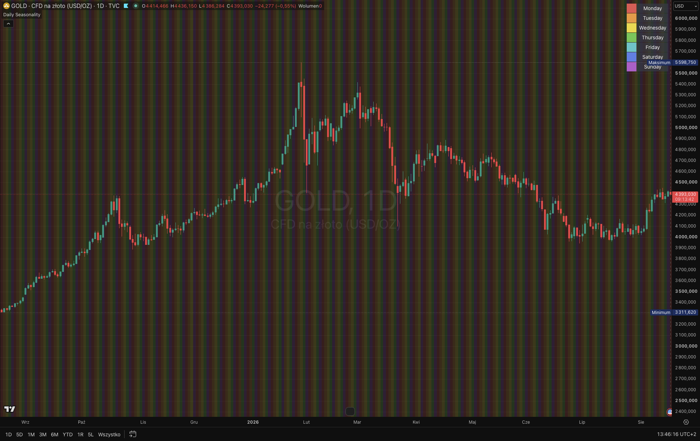

#### [Hourly Seasonality](indicators/seasonality/hourly-seasonality.pine)

Chart background colored by hour - a daily gradient (night → dawn → day → dusk). Active hours selected with a text field, e.g. `"9-16,18,22"`.

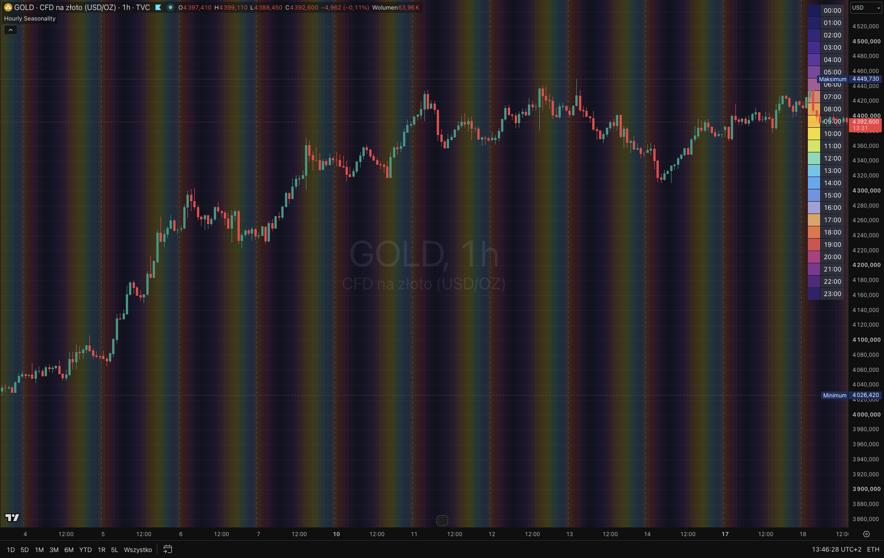

### Oscillators

#### [MACD](indicators/oscillators/macd.pine)

Moving Average Convergence Divergence - the difference of a fast and a slow average (default EMA 12/26, types configurable) with a signal line (default EMA 9). Histogram of the MACD minus signal difference, optional signal markers (configurable shape and size) on the price panel at crossings, a status table, and built-in alerts.

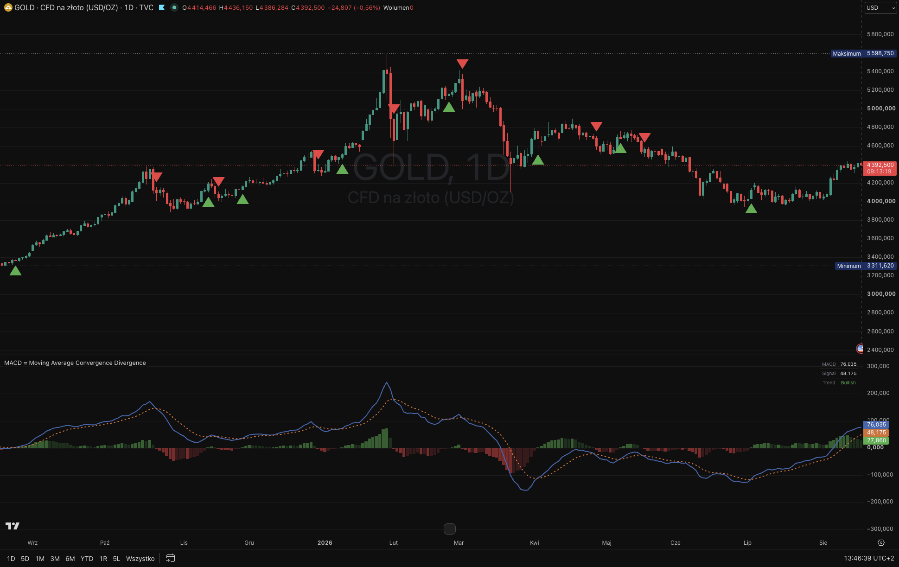

#### [MA Spread Histogram](indicators/oscillators/ma-spread-histogram.pine)

A histogram showing the distance between two moving averages (short minus long), with markers on their crossovers.

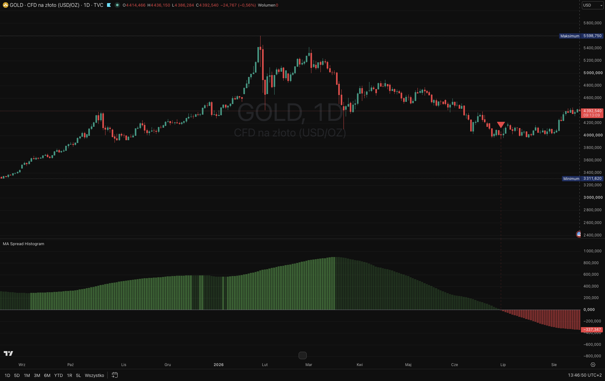

#### [Stochastic Oscillator](indicators/oscillators/stochastic-oscillator.pine)

Stochastic Oscillator - %K and %D lines with overbought/oversold levels (default 80/20), a zone gradient, optional signal markers (configurable shape and size) on the price panel when %K crosses %D coming out of an extreme zone, a status table, and built-in alerts.

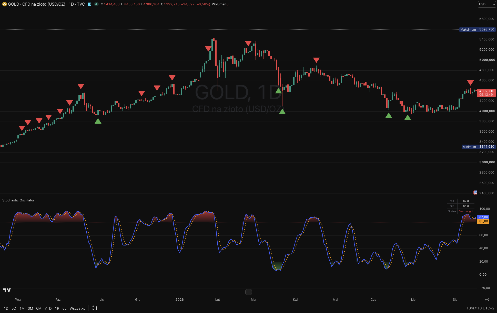

#### [RSI](indicators/oscillators/rsi.pine)

Relative Strength Index with configurable overbought/oversold levels (default 70/30) and a zone gradient. Optional smoothing MA (also with Bollinger Bands), regular bull/bear divergences, mean-reversion signal markers (configurable shape and size) on the price panel, a status table, and built-in alerts.

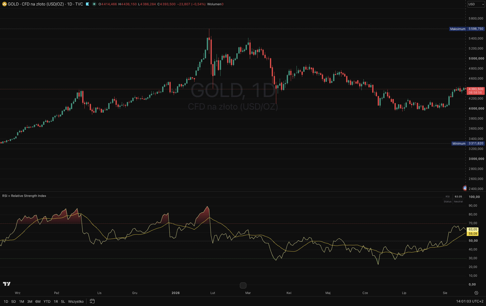

#### [ROC](indicators/oscillators/roc.pine)

Rate of Change - the percentage price change over a given period. Optional signal markers (configurable shape and size) on the price panel at zero crosses.

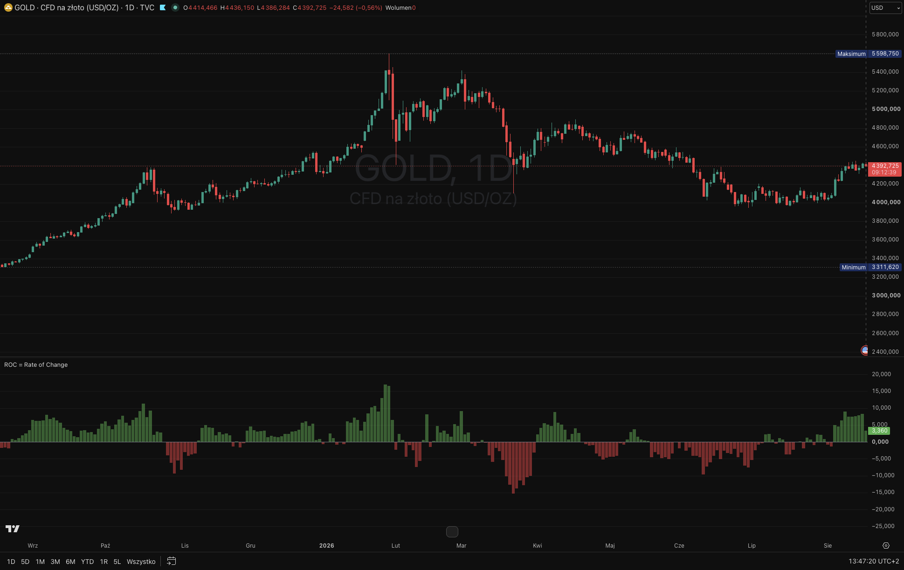

### Volume

#### [Accumulation / Distribution Density](indicators/volume/accumulation-distribution-density.pine)

> 📖 Full documentation: [Accumulation / Distribution Density](indicators/volume/accumulation-distribution-density.md)

Accumulation / distribution density (VD) - modeled after Mieczyslaw Siudek's indicator from xStation (XTB). Looks for candles whose volume-to-price-movement ratio (**density** = volume per unit of range) is disproportionately high and which set a local extreme - heavy turnover with little movement at a low/high suggests position accumulation/distribution and a potential turning point. **▲ marker** below a candle = accumulation density (potential bullish signal), **▼ marker** above a candle = distribution density (potential bearish signal); the marker shape (triangle, arrow, label arrow, circle, diamond), size, and colors are configurable. Parameters as in xStation: Max/Min of, Average Spread of, Average Density of, Spread Factor (with a toggle), Density Factor, and the Bar close % filter. Built-in `alertcondition` for both signals. Requires an instrument with volume data (TVC CFDs lack it - use e.g. futures contracts).

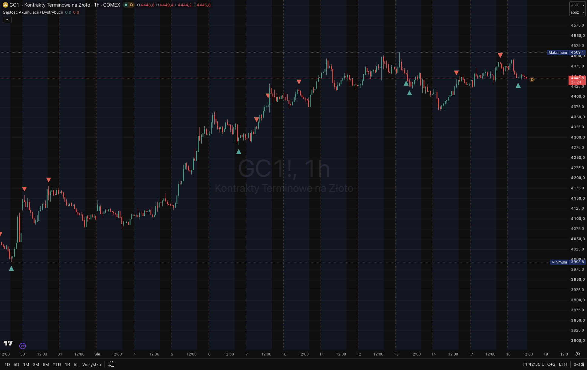

#### [Delta Footprint Bubble](indicators/volume/delta-footprint-bubble.pine)

> 📖 Full documentation: [Delta Footprint Bubble](indicators/volume/delta-footprint-bubble.md)

Volume delta from real footprint data (`request.footprint()`, available since January 2026) - the difference between aggressive buy volume (at the ask) and sell volume (at the bid) within a candle. The value shown as a **number next to each candle** (green = buy dominance, red = sell; above/below the candle or above/below the POC bubble, with a configurable gap). Each candle's POC as an **optional Bookmap-style bubble** (size ∝ volume, the same power normalization as in the histogram), with an optional **POC trail** (a line connecting the bubbles - a segmented polyline or a smooth, rounded curve). Additionally **Value Area (VAH/VAL)** and a session **CVD** (in the data window). When the candle direction contradicts the delta (rising with negative delta or falling with positive) - the delta number is shown **in bold**.

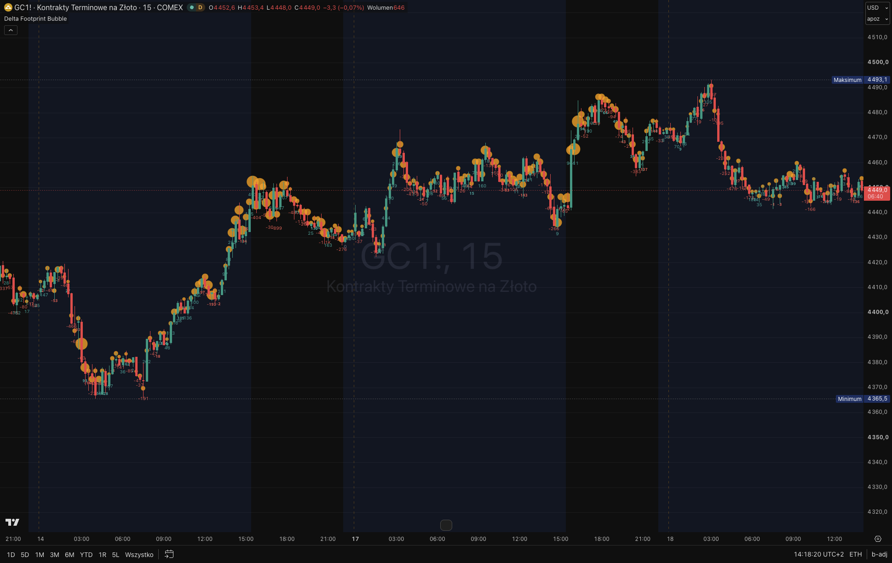

> ⚠️ Requires a TradingView **Premium** or **Ultimate** account - without it the script does not compile. `request.footprint()` works only for the chart's **current timeframe**.

#### [Delta Footprint Histogram](indicators/volume/delta-footprint-histogram.pine)

> 📖 Full documentation: [Delta Footprint Histogram](indicators/volume/delta-footprint-histogram.md)

The footprint delta as a **histogram in a separate panel** (behaves like the built-in Volume indicator): a column = the candle's |delta|, green with buy dominance, red with sell. The real delta as a **number on the column** and in the data window; with the cursor, the legend shows the true value (not the normalized height). The height is **power-normalized** (adjustable strength) and capped at a given % of the panel.

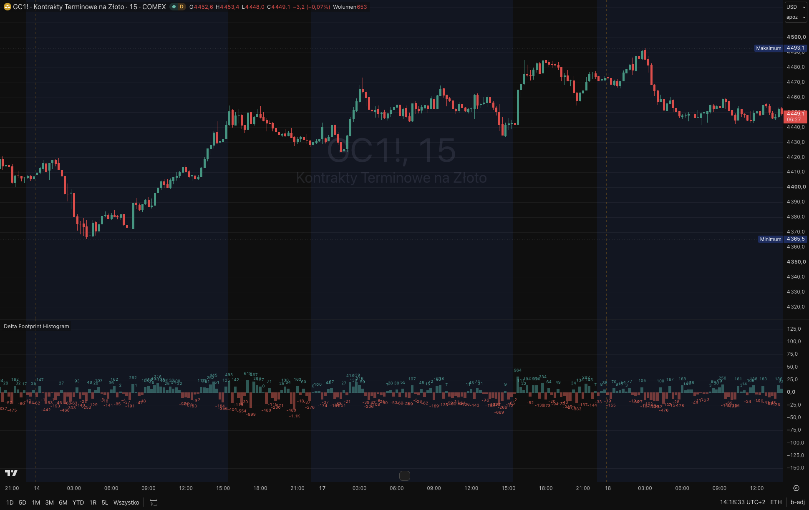

> ⚠️ Requires **Premium / Ultimate**; `request.footprint()` only for the current timeframe.

#### [Delta Footprint Table](indicators/volume/delta-footprint-table.pine)

> 📖 Full documentation: [Delta Footprint Table](indicators/volume/delta-footprint-table.md)

A standalone footprint **status table** (buy / sell / delta + % / **stacked imbalance** / POC / Value Area / CVD) in a chart corner - extracted from "Bubble", it computes its own metrics, so it works independently. Add it next to "Delta Footprint Bubble" or "Delta Footprint Histogram". The **Imbalance** row summarizes the current candle's stacked diagonal imbalances (▲ buy levels, ▼ sell levels). The header bar shows the **current timeframe** ("Last candle · 1m") and reminds you that buy/sell/delta/POC apply **only to the last candle** (CVD accumulates over the session).

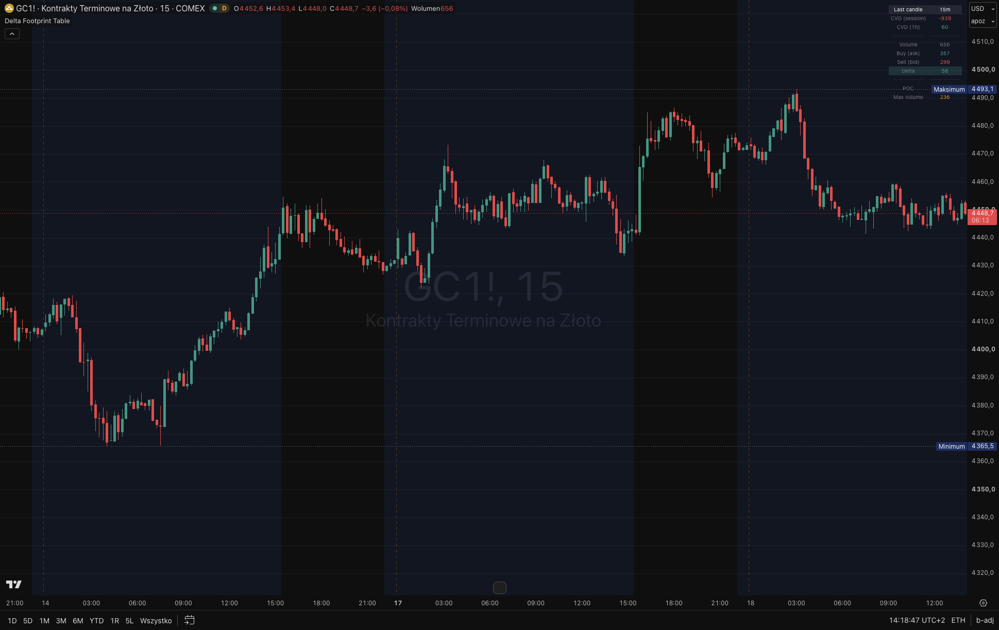

> ⚠️ Requires **Premium / Ultimate**; `request.footprint()` only for the current timeframe.

## License

[The MIT License](https://piecioshka.mit-license.org) @ 2026
